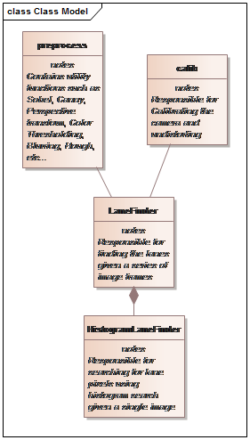
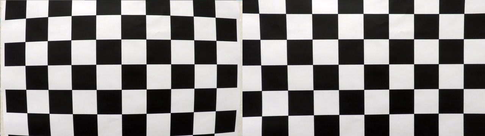
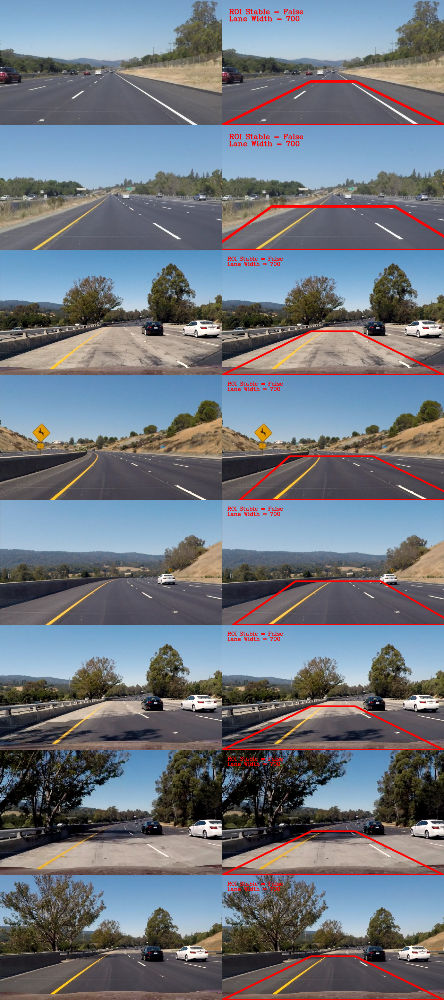
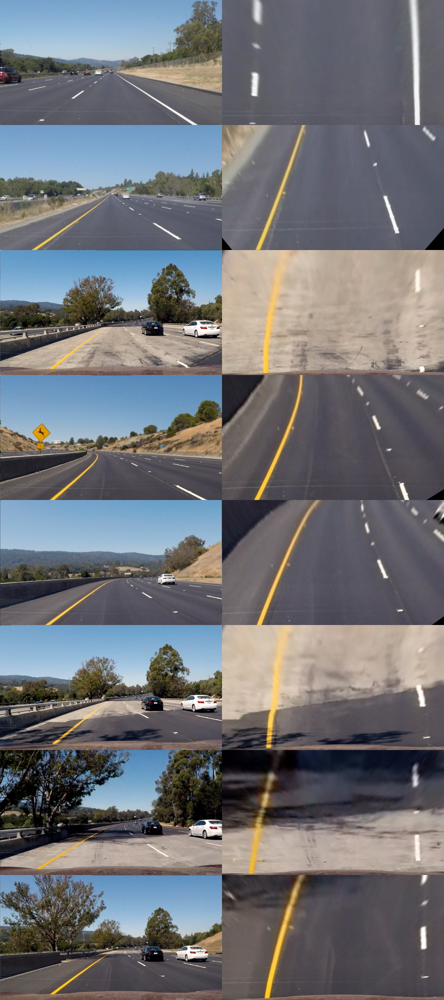
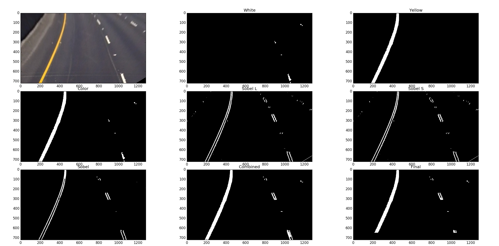
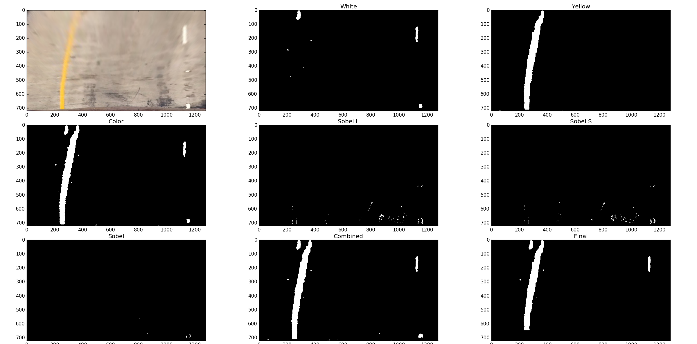
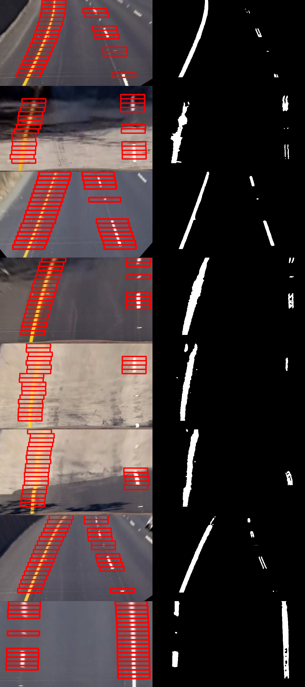
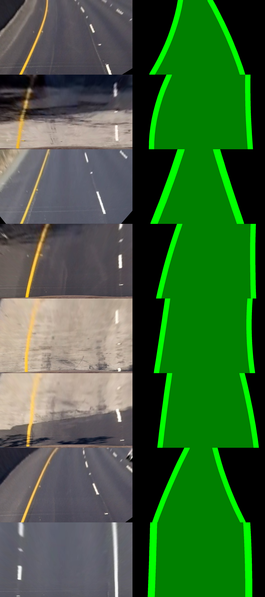
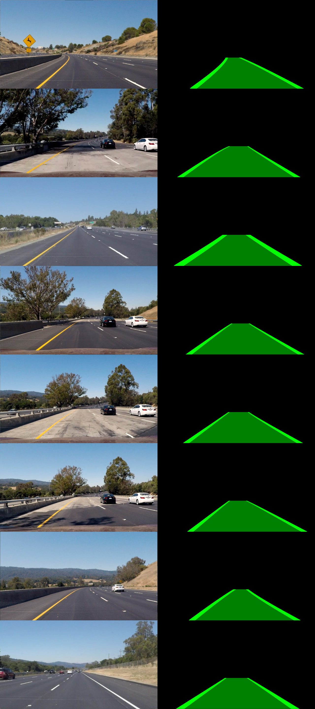
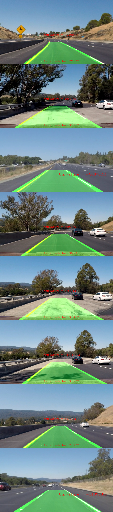

# Advanced Lane Finding
## Introduction
This is Project 4 of the Self Driving Car Nanodegree offerred by 
Udacity. In this project, we need to extend the work that we did 
in [Project1](https://github.com/mohankarthik/CarND-LaneLines-P1),
and find curved lane lines, while also detecting the radius of
 curvature and the deviation from the lane. 

## Software Architecture
The software is organized into the following classes

**Classes**

* preprocess.py: Contains utility functions such as Sobel, 
Canny, Perspective transform, Color Thresholding, Blurring, Hough, etc...
* calib.py: Responsible for Calibrating the camera and removing
camera distortion
* LaneFinder.py: Responsible for finding the lanes given a series of 
image frames
  * This contains two classes, the LaneFinder class and the 
  HistogramLaneFinder class

## Camera Calibration
The first step towards the advanced lane finding is to calibrate
the camera so that there is no distortion in the image that we are
processing. This is important because
> Determining radius of curvature needs the image to be undistored

To do this, we do the following

1. Take a set of images of a standard pattern (like a checkerboard),
using the camera in question. The images must be taken with the
checkerboard at various angles and distances.
2. Find the chessboard corners using `cv2.findChessboardCorners`
3. Use the found points, along with an idealized set of points
to find the distortion / calibration matrix using `cv2.calibrateCamera`
4. Use the calibration matrix to undistort the image using
`cv2.undistort`

After calculating the distortion matrix, I undisorted a test 
image to this effect

Next step is to undistort the actual test images and this was 
the results

You can notice small changes in the corners of the images that 
has been corrected owing to the distortion correction.

Refer to calib.py for the code that implements Camera Calibration

## First time / Image pipeline
### First time ROI
Region of Interest is critical to most Computer Vision algorithms.
The reason being that searching through the entire image is both
computationally expensive, and difficult in avoiding spurious
image artifacts. So searching within a defined ROI is both 
computationally better, and algorithmically easier.

The first time we see a video, or a single image, the software
has to start searching from scratch. To do this, we use the 
hough transform that we used in the previous project. The 
code is as follows

1. Convert to grayscale `bnw = cv2.cvtColor(img, cv2.COLOR_RGB2GRAY)`
2. Apply a guassian blur `flt = guassian_blur(bnw, 21)`
3. Do Canny edge detection`cny = preprocess.canny(flt, 40, 50)`
4. Apply a wide ROI`roi = preprocess.region_of_interest(cny, np.int32([ROI]))`
5. Find the hough lane lines `verts = preprocess.hough_lines(roi, 1, np.pi/48, 50, 1, 60, ROI[1][1])`

As you can see, this also needs an ROI, which is set to a broad
range which should cover most lane lines in any image.

Running this on the test images gets us the following

The hough transform approximately gets the ROI and we add a big
error offset for it, so that we don't inadvertently miss the lane
lines.

The code can be seen in the function __find_roi in LaneFinder.py

### Perspective transform
Now that we've the ROI, we transform this ROI and stretch it to
get our psuedo vertical lane lines. But since we've allowed for
plenty of grace in our ROI find, the perspective transform
will not be vertical for the first few images of our video. Our
dynamic ROI tracker will take care of it later. But at the 
moment, for single images, the transform is going to be only 
partially complete

What we do is the following

1. Use the ROI points found in the previous section as source points
2. Use the image edges as the destination points
3. Compute the transform using `cv2.getPerspectiveTransform`
4. Apply the transform using `cv2.warpPerspective`

Running this on the test images using the ROI got from the previous
section gives us the following

As you can see, not all the transforms gives us perfectly 
parallel lanes. But that's ok. This is a good start.

The code for this can be seen in preprocess.py

### Binary Thresholding
Binary thresholding is the method by which we extract the features (the
important pixels) from the image. We do it with a combination of methods.

#### Color selection
The first of these are color selection. Almost every lane in the world
is either white or yellow. So we try and apply masks onto the image
that will be able to select these colors out from the image. Also to
select colors, we first transform the image to HSV color space, where
the hue and saturation levels are excellent markers to select out the
color

1. We select white pixels with a range of `cv2.inRange(hsv, (20, 0, 180), (255, 80, 255))`
2. We slect yellow pixels with a range of `cv2.inRange(hsv, (0, 80, 100), (50, 255, 255))`
These two masks are then combined to form a color thresholded image

#### Gradient thresholding
Using color threshold is not the best option always. Because many times,
the road itself might be 'whitish', thus the road also get's selected.
To avoid this, we are forced to select very strict thresholds for the
color and also, we arent' sure if they are going to work in all
possible cases.

Another limitation of color selection is that generally because of blurring,
the edges of the lanes do not get selected and it's only the middle portion
that get's selected.

We can augment color selection using Sobel edge maps. Sobel is just
a edge detection convolution operator that highlights changes. So it can
pick up pixels which have the highest change. So typically it picks up
the two lane ends. So it's great to use this along with color.
Sobel also picks up pretty muche very other noise, so we've to be very
careful in using Sobel.

Sobel has the advantage of being independantly available on the x and y
direction. So we take the gray channel (l in hsv) and the saturation
channel (s in hsv) and apply sobel x and sobel y to it. We are interested
in vertival lanes, so we give very low thresholds fo the sobel y and
concentrated more on the sobel x

1. We apply Sobel x with a threshold of (50, 255)
2. We apply Sobel y with a threshold of (200, 255)

#### Combining the thresholds
We apply more guassian and median blurs to the color and gradient
thresholds and then combine them. The results are as follows:

This is an easy image, and the color selection is able to get all the
lane lines directly. The sobel adds a wrapper to the pixels found
by the color selection thus completing our thresholding very nicely.

Moving onto the next image

This is a difficult image. ALthough the yellow mask does a really good
job picking out the yellow lane, the white struggles and gets only a
very small portion. The sobel does really badly as well. But still we
have a passable threshold.

The code to this is defined in __threshold_image function in LaneFinder.py

### Histogram Search
This is the most important part of the entire pipeline. Now that we've the
lane pixels, we will need to walk up the image and find the prospective
lanes from here.

we first divide the image into 20 horizontal regions that are stacked
vertically. Then for each of the slice, we compute a running (smoothened)
mean. So we've a histogram array of 20x1280. Then we search from the bottom
of the image.

As the lanes change (turns), the bottom always almost remains constant,
unless the vechicle moves. Even in the case where the vechicle moves,
the distance between the lanes are still constant. We use this fact to
constrain the search as it moves up.

At the begining, we assume the lane distance with an approximate value
and allow for a large variation. As we find lane lines with increasing
accuracy, we lower the allowed variation, so as to automatically drop
outliers. When our algorithm is unable to find lanes in some horizontal
regions, we again increase the allowed variation, so as to catch the lane
when it next appears.

Once we find the lanes, we mask out the remaining image to select out
only the lane pixels and remove all the outliers.

Here is the results on the test images:

You can see that the histogram search does a terrific job of finding
the lanes in each of the test images.

### Derive Fit
Getting a fit once we find the lane pixels is very easy. We simply
compute all the x's and y's corresponding to each of the lanes (left and
right) and feed them into `np.polyfit`

### Drawing the overlay
This again is easy. We just recreate an idealized set of x's and y's from
the fit that we've derived and we draw the lanes.

Here is the results on the test images

Once this is done, we can transform this overlay back to the perspective
view by doing `cv2.warpPerspective` with the inverse matrix and that will
give us

Then we just add this image onto the original image. We can also compute
the [radius of curvature](https://en.wikipedia.org/wiki/Radius_of_curvature)
from the fit, as well as how far we are offset from the lane center and
we add this too to the image.

This completes our activity for processing each image individually

## Tracking
Tracking is the activity of using the previous frame's information to
process the next frame. There are multiple areas in which tracking is
used in this project

### Region of Interest
The first and the most important is the region of interest. We want the
ROI to dynamically change to correctly fit the lanes so that our lanes
are always perpendicular in the bird's eye view. This allows our radius
of curvature calculations to be more accurate.

So what we do is

1. Take the fit values from the previous frame
2. Compare the lane's top position with the idealized values (i.e we want
the left lane to intercept at around the 10% of image width and the right
lane to intercept the image top at around 90% of the image width)
3. Adjust the ROI slightly (it's sensitive because we are calculating the
intercepts in the bird's eye frame, while the ROI affects the perspective
frame).
4. Rinse and repeat until it stabilizes (actual - idealized is less than
a defined threshold)
5. Keep monitoring for any change required.

Here is how the ROI changes dynamically

And corresponding, this is how the bird's eye view changes

### Motion Blur